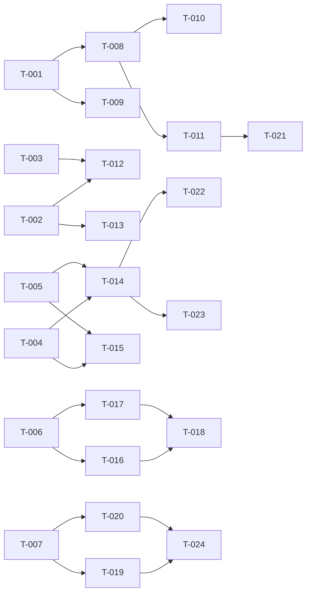

# Build Site: audit-gap fixes

Concrete implementation plan covering the 2026-05-19 cavekit batch:
soc-watchdog, sensor-i2c-recovery, pmic-thermal, wifi-suspend-wake,
usb-phy-tuning. The existing cavekit-spm-init is in testing per
`context/impl/impl-spm-init.md` and contributes no new tasks here; its
acceptance criteria are listed in the Coverage Matrix as COVERED by
that impl doc.

Source kits:
- `context/kits/cavekit-spm-init.md` — R1..R5 (COVERED by impl-spm-init.md)
- `context/kits/cavekit-soc-watchdog.md` — R1..R4
- `context/kits/cavekit-sensor-i2c-recovery.md` — R1..R3
- `context/kits/cavekit-pmic-thermal.md` — R1..R5
- `context/kits/cavekit-wifi-suspend-wake.md` — R1..R4
- `context/kits/cavekit-usb-phy-tuning.md` — R1..R4

External preconditions:
- `context/impl/impl-mpm-boot-hang.md` — must resolve before
  wifi-suspend-wake R1 can pass.

## Tier 0 — No dependencies (start here)

| Task | Title | Cavekit | Requirement | blockedBy | Effort |
|------|-------|---------|-------------|-----------|--------|
| T-001 | Investigate mainline watchdog binding applicability for MSM8660 (Scorpion) and record decision in `impl-soc-watchdog.md` | soc-watchdog | R1 | none | M |
| T-002 | Implement GSBI3 I2C bus-recovery using GPIO recovery (SCL=GPIO43, SDA=GPIO44) and verify wedged-bus auto-recovery on hardware | sensor-i2c-recovery | R1 | none | M |
| T-003 | Choose SCL recovery cycle count (legacy 36 vs mainline 9), record rationale in `impl-sensor-i2c-recovery.md`, and meet AC R3a/R3b | sensor-i2c-recovery | R3 (ACa,ACb) | none | S |
| T-004 | Add PM8058 die-temp thermal zone in DT (or driver) with three trip points at 105/125/145 deg C and hysteresis <= 2 C, declare polled-vs-IRQ approach in `impl-pmic-thermal.md` | pmic-thermal | R1 | none | M |
| T-005 | Add PM8901 die-temp thermal zone with same 3-trip geometry; cover both legacy IRQs (`TEMP_ALARM` + `TEMP_HI_ALARM`) or document single-event equivalence in impl doc | pmic-thermal | R2 | none | M |
| T-006 | Investigate mainline USB-PHY programming path for ULPI vendor regs 0x30-0x3F (or absence thereof); write conclusion to `impl-usb-phy-tuning.md` citing driver source by file path and binding name | usb-phy-tuning | R1 | none | M |
| T-007 | Resolve MPM boot hang per `impl-mpm-boot-hang.md` so MPM probes, boot completes, and MPM-routed wakeup sources are visible to the kernel — owned by impl-mpm-boot-hang, listed here for traceability only [EXTERNAL] | wifi-suspend-wake | R1 | external (impl-mpm-boot-hang.md resolution) | L |

## Tier 1 — Depends on Tier 0

| Task | Title | Cavekit | Requirement | blockedBy | Effort |
|------|-------|---------|-------------|-----------|--------|
| T-008 | [CONDITIONAL on T-001 = enable] Add `qcom,kpss-wdt`-class watchdog DT node to MSM8660 DTSI and verify `/dev/watchdogN` is exposed with non-zero `wdctl` timeout | soc-watchdog | R2 (enable path) | T-001 | M |
| T-009 | [CONDITIONAL on T-001 = won't-fix] Record won't-fix decision in `impl-soc-watchdog.md` including reason mainline cannot drive MSM8660 watchdog and what would change the conclusion (satisfies R2/R3/R4 won't-fix paths) | soc-watchdog | R2/R3/R4 (won't-fix path) | T-001 | S |
| T-010 | Sync defconfig flags (`CONFIG_WATCHDOG`, `CONFIG_QCOM_WDT` or chosen driver) across `tenderloin_defconfig`, `tenderloin_debug_defconfig`, `tenderloin_fast_defconfig` — only if T-008 chosen path | soc-watchdog | R2 (defconfig support) | T-008 | S |
| T-011 | Verify no boot/shutdown regression: 5x consecutive cold boots to userspace login, 30 min userspace pet test, clean orderly poweroff (only meaningful if T-008 executed) | soc-watchdog | R3 | T-008 | M |
| T-012 | Synthetic-wedge release-rate test on GSBI3: 100 trials, match target rate to T-003's cycle choice (100% if >=36, >=95% if =9, custom if intermediate) | sensor-i2c-recovery | R3 (ACc) | T-002, T-003 | M |
| T-013 | Healthy-bus regression test: cold-boot probe of mpu3050 + isl29023 as IIO devices and 24-hour nominal-poll run with no recovery attempts and no latency regression | sensor-i2c-recovery | R2 | T-002 | M |
| T-014 | Wire 145 deg C trip as `THERMAL_TRIP_CRITICAL` and verify `emul_temp` injection triggers `orderly_poweroff` within 30 s with clean shutdown (no panic, fs synced) | pmic-thermal | R3 | T-004, T-005 | M |
| T-015 | Sync defconfig thermal flags (`CONFIG_THERMAL_OF`, `CONFIG_THERMAL_EMULATION`, any PMIC-thermal driver flag) across `tenderloin_defconfig`, `tenderloin_debug_defconfig`, `tenderloin_fast_defconfig` | pmic-thermal | R1/R2/R3 (defconfig support) | T-004, T-005 | S |
| T-016 | [CONDITIONAL on T-006 = path-exists] Apply legacy USB PHY tuning values (pre-emphasis 20%, hsdrvslope 0x05, CDR auto-reset disabled, SE1-gating disabled) via the path identified in T-006, and verify values from driver state / register dump / debugfs | usb-phy-tuning | R2 | T-006 | M |
| T-017 | [CONDITIONAL on T-006 = no-path] Record won't-fix in `impl-usb-phy-tuning.md` with concrete driver/binding line citations and revisit conditions | usb-phy-tuning | R4 | T-006 | S |
| T-018 | USB enumeration + bulk-transfer regression test: 10 plug/unplug cycles, 1 GiB bulk transfer with no error lines, mean rate within 10% of baseline — runs in either T-016 or T-017 outcome | usb-phy-tuning | R3 | T-016, T-017 | M |
| T-019 | Declare SDC4 DAT1 as wakeup source via MPM in DT/driver (e.g. `wakeup-source`, `interrupts-extended` to MPM) and verify `power/wakeup`, kernel log registration, and MPM-side debugfs/log trace | wifi-suspend-wake | R2 | T-007 | M |
| T-020 | Configure WoWLAN via cfg80211/nl80211 on ath6kl: `iw phy phy0 wowlan enable any` succeeds, survives suspend/resume, takes effect while associated | wifi-suspend-wake | R3 | T-007 | M |

## Tier 2 — Depends on Tier 1

| Task | Title | Cavekit | Requirement | blockedBy | Effort |
|------|-------|---------|-------------|-----------|--------|
| T-021 | Watchdog lock-recovery test: induce kernel lockup (SysRq-c or synthetic hung-task stub with IRQ disabled) and confirm hardware reset within configured window +/- 1 tick, with pstore preserving previous boot log (only if T-008 executed) | soc-watchdog | R4 (enable path) | T-011 | M |
| T-022 | User-space-daemon independence verification: with no `thermald`/`tmon`/equivalent running (verified via `ps`), repeat T-014's `emul_temp` critical-trip injection and confirm `orderly_poweroff` still dispatches | pmic-thermal | R4 | T-014 | S |
| T-023 | Measure trip-to-shutdown latency on real hardware: time from `emul_temp` write to `orderly_poweroff` dispatch; record value in `impl-pmic-thermal.md`; assert <= 5 s for polled or <= 1 s for IRQ approach declared in T-004 | pmic-thermal | R5 | T-014 | M |
| T-024 | End-to-end WiFi wake from suspend-to-RAM: `echo mem > /sys/power/state` blocks, external host ICMP echo wakes device within 5 s with cause-of-wake annotation in dmesg/pstore, no panic/lockup on resume, working shell post-resume | wifi-suspend-wake | R4 | T-019, T-020 | L |

## Summary

| Tier | Tasks | Notes |
|------|-------|-------|
| 0    | 7     | 6 in-kit starting points + 1 external precondition (T-007) for traceability |
| 1    | 13    | conditional branches resolve here (T-008/T-009, T-016/T-017) |
| 2    | 4     | end-to-end verifications and latency-bound AC |
| Total | 24   | spm-init contributes 0 new tasks (impl-spm-init.md covers R1-R5) |

Conditional / external markers:
- T-007 is `[EXTERNAL]` — owned by impl-mpm-boot-hang.md, blocks T-019/T-020/T-024.
- T-008, T-010, T-011, T-021 only execute on T-001 = "binding exists" outcome.
- T-009 only executes on T-001 = "no binding exists" outcome (satisfies soc-watchdog R2/R3/R4 won't-fix path).
- T-016 only executes on T-006 = "programming path identified" outcome.
- T-017 only executes on T-006 = "no path exists" outcome.
- T-018 runs in either USB outcome — it is the regression guard, not a conditional.

## Coverage Matrix

Every acceptance criterion from every kit is listed. AC counts are
per-kit-requirement. Entries marked COVERED indicate the AC is already
satisfied by prior work; no new task is needed.

| Kit | Req | AC summary | Task(s) |
|-----|-----|-----------|---------|
| spm-init | R1 | All 5 ACs (extend `struct spm_reg_data`, u32 widths, per-CPU clock fields) | COVERED (impl-spm-init.md Phase 1) |
| spm-init | R2 | All 12 ACs (spm_cfg=0x1C, pmic_dly, wake_tmr_dly, slp_clk_en cpu0/cpu1, hsfs_preclmp/postclmp, slp_clmp_en, spm_mpm_cfg, spm_ctl_init, slp_rst_en_init, match legacy table) | COVERED (impl-spm-init.md Phase 2) |
| spm-init | R3 | All 13 ACs (write 10 SAW regs in order, read-back verification, verbose logging) | COVERED (impl-spm-init.md Phase 3) |
| spm-init | R4 | All 4 ACs (CPU0=0x01, CPU1=0x13, CPU index from DT/platdata, single-CPU fallback) | COVERED (impl-spm-init.md Phase 4) |
| spm-init | R5 | All 3 ACs (remove bad comment, add correct comment, reference investigation) | COVERED (impl-spm-init.md Phase 5) |
| soc-watchdog | R1 | AC1 conclusion in impl-soc-watchdog.md | T-001 |
| soc-watchdog | R1 | AC2 candidate driver identified by file path / binding name (or "none") | T-001 |
| soc-watchdog | R1 | AC3 register block + reset behaviour matched against MSM8660 memory map | T-001 |
| soc-watchdog | R1 | AC4 decision (enable / won't-fix) recorded with rationale | T-001 |
| soc-watchdog | R2 | AC1 `/dev/watchdogN` exposed at boot (enable path) | T-008 |
| soc-watchdog | R2 | AC2 `wdctl` reports non-zero timeout (enable path) | T-008 |
| soc-watchdog | R2 | AC3 won't-fix recorded with reason + revisit conditions (won't-fix path) | T-009 |
| soc-watchdog | R3 | AC1 5 cold boots to userspace login | T-011 |
| soc-watchdog | R3 | AC2 30 min userspace-pet idle alive | T-011 |
| soc-watchdog | R3 | AC3 orderly poweroff within grace window without spurious reset | T-011 |
| soc-watchdog | R4 | AC1 induced lockup -> HW reset within window +/-1 tick | T-021 |
| soc-watchdog | R4 | AC2 fresh boot post-reset with previous log preserved in pstore | T-021 |
| soc-watchdog | R4 | AC3 won't-fix path: documented as intentionally unimplemented | T-009 |
| sensor-i2c-recovery | R1 | AC1 stuck-SDA -> transfer succeeds or `-EAGAIN` | T-002 |
| sensor-i2c-recovery | R1 | AC2 recovery attempt visible in dmesg | T-002 |
| sensor-i2c-recovery | R1 | AC3 post-recovery normal transfer to healthy slave succeeds | T-002 |
| sensor-i2c-recovery | R1 | AC4 no reboot required | T-002 |
| sensor-i2c-recovery | R2 | AC1 mpu3050 probes as IIO with expected channels | T-013 |
| sensor-i2c-recovery | R2 | AC2 isl29023 probes as IIO with expected channels | T-013 |
| sensor-i2c-recovery | R2 | AC3 24-hour run: no recovery logged | T-013 |
| sensor-i2c-recovery | R2 | AC4 steady-state read latency not measurably worse | T-013 |
| sensor-i2c-recovery | R3 | AC1 chosen recovery cycle count >= 9 | T-003 |
| sensor-i2c-recovery | R3 | AC2 chosen count + rationale recorded in impl plan | T-003 |
| sensor-i2c-recovery | R3 | AC3 synthetic-wedge release rate over 100 trials meets target | T-012 |
| pmic-thermal | R1 | AC1 PM8058 thermal zone exists with identifying `type` | T-004 |
| pmic-thermal | R1 | AC2 idle reading 15000-80000 mC | T-004 |
| pmic-thermal | R1 | AC3 three trip points at 105/125/145k mC +/- 1k mC | T-004 |
| pmic-thermal | R1 | AC4 hysteresis <= 2000 mC | T-004 |
| pmic-thermal | R2 | AC1 PM8901 zone exists distinct from PM8058 | T-005 |
| pmic-thermal | R2 | AC2 idle reading 15000-80000 mC | T-005 |
| pmic-thermal | R2 | AC3 three trip points at 105/125/145k mC | T-005 |
| pmic-thermal | R2 | AC4 hysteresis <= 2000 mC | T-005 |
| pmic-thermal | R2 | AC5 both `TEMP_ALARM` and `TEMP_HI_ALARM` reachable or single-event equivalence documented | T-005 |
| pmic-thermal | R3 | AC1 emul_temp >= 145000 produces critical-trip log line | T-014 |
| pmic-thermal | R3 | AC2 `orderly_poweroff` dispatched within 30 s | T-014 |
| pmic-thermal | R3 | AC3 clean poweroff (fs sync, no panic in pstore next boot) | T-014 |
| pmic-thermal | R4 | AC1 no userspace daemon running, emul_temp injection still triggers poweroff | T-022 |
| pmic-thermal | R5 | AC1 impl plan declares polled vs IRQ approach with rationale | T-004 |
| pmic-thermal | R5 | AC2 polled latency <= 5 s | T-023 |
| pmic-thermal | R5 | AC3 IRQ-driven latency <= 1 s | T-023 |
| pmic-thermal | R5 | AC4 measured latency recorded in impl doc | T-023 |
| wifi-suspend-wake | R1 | AC1 MPM driver probes with DT node enabled | T-007 |
| wifi-suspend-wake | R1 | AC2 boot completes without impl-mpm-boot-hang-class hang | T-007 |
| wifi-suspend-wake | R1 | AC3 wakeup sources visible via standard interface | T-007 |
| wifi-suspend-wake | R2 | AC1 `power/wakeup` shows `enabled` on SDC4 host or WiFi child | T-019 |
| wifi-suspend-wake | R2 | AC2 boot log records wakeup-source registration for SDC4-DAT1/WiFi | T-019 |
| wifi-suspend-wake | R2 | AC3 MPM-side trace confirms SDC4 DAT1 routed through MPM | T-019 |
| wifi-suspend-wake | R3 | AC1 `iw phy phy0 wowlan enable any` returns success | T-020 |
| wifi-suspend-wake | R3 | AC2 WoWLAN config survives suspend/resume | T-020 |
| wifi-suspend-wake | R3 | AC3 config takes effect while already associated | T-020 |
| wifi-suspend-wake | R4 | AC1 `echo mem > /sys/power/state` blocks until resume | T-024 |
| wifi-suspend-wake | R4 | AC2 external ICMP echo replied within 5 s | T-024 |
| wifi-suspend-wake | R4 | AC3 cause-of-wake annotation in dmesg/pstore | T-024 |
| wifi-suspend-wake | R4 | AC4 device returns fully functional post-resume | T-024 |
| usb-phy-tuning | R1 | AC1 conclusion in impl-usb-phy-tuning.md | T-006 |
| usb-phy-tuning | R1 | AC2 candidate driver identified by file path / binding name | T-006 |
| usb-phy-tuning | R1 | AC3 vendor reg 0x30-0x3F reachability + recommended route stated | T-006 |
| usb-phy-tuning | R1 | AC4 if no route, documented with reference to driver source | T-006 |
| usb-phy-tuning | R2 | AC1 pre-emphasis 20% configured | T-016 |
| usb-phy-tuning | R2 | AC2 HS driver slope 0x05 configured | T-016 |
| usb-phy-tuning | R2 | AC3 CDR auto-reset disabled | T-016 |
| usb-phy-tuning | R2 | AC4 SE1 gating disabled | T-016 |
| usb-phy-tuning | R2 | AC5 applied values verifiable from driver state / dump / debugfs | T-016 |
| usb-phy-tuning | R3 | AC1 10 plug/unplug cycles enumerate cleanly | T-018 |
| usb-phy-tuning | R3 | AC2 1 GiB bulk transfer without controller-driver errors | T-018 |
| usb-phy-tuning | R3 | AC3 mean rate within 10% of pre-change baseline | T-018 |
| usb-phy-tuning | R4 | AC1 limitation recorded with specific driver/binding line citations | T-017 |
| usb-phy-tuning | R4 | AC2 revisit conditions noted | T-017 |
| usb-phy-tuning | R4 | AC3 no regression — R3 still passes with default PHY | T-018 |

All 76 acceptance criteria are covered. No rows are `GAP`; no rows
required `[needs review]`.

## Dependency Graph

Notes on the graph:
- T-007 is the external MPM precondition; arrows from it represent
  hard-gate edges for the wifi-suspend-wake branch.
- T-008/T-009 and T-016/T-017 are mutually exclusive conditional
  branches — only one of each pair executes per outcome of the
  investigation task that gates it.
- T-018 has two incoming edges because it is the regression guard that
  runs in either USB outcome (one or the other of T-016/T-017 will
  always have executed).
