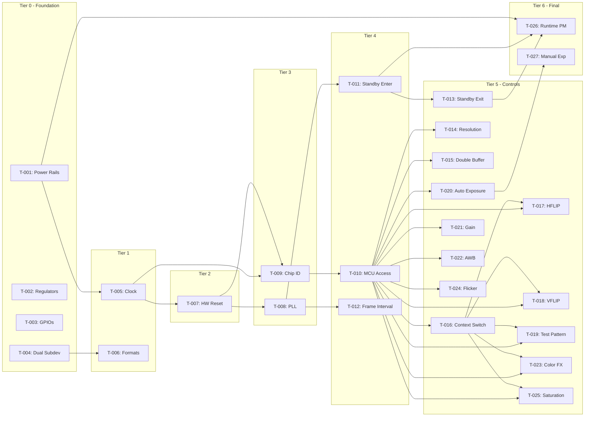

# Build Site: MT9M113 Camera Sensor Driver

**Created:** 2026-04-14
**Status:** Planning Complete
**Total Tasks:** 33
**Total Acceptance Criteria:** 67

---

## Tier 0 - No Dependencies (Start Here)

| Task | Title | Cavekit | Requirement | blockedBy | Effort |
|------|-------|---------|-------------|-----------|--------|
| T-001 | Power Rail Sequencing | power | R1 | none | M |
| T-002 | Regulator Handling | power | R9 | none | M |
| T-003 | GPIO Handling | power | R10 | none | M |
| T-004 | Dual Subdevice Registration | core | R3 | none | L |

---

## Tier 1 - Depends on Tier 0

| Task | Title | Cavekit | Requirement | blockedBy | Effort |
|------|-------|---------|-------------|-----------|--------|
| T-005 | Clock Configuration | power | R2 | T-001 | M |
| T-006 | Format Enumeration | core | R4 | T-004 | L |

---

## Tier 2 - Depends on Tier 1

| Task | Title | Cavekit | Requirement | blockedBy | Effort |
|------|-------|---------|-------------|-----------|--------|
| T-007 | Hardware Reset | power | R3 | T-005 | M |

---

## Tier 3 - Depends on Tier 2

| Task | Title | Cavekit | Requirement | blockedBy | Effort |
|------|-------|---------|-------------|-----------|--------|
| T-008 | PLL Configuration | power | R4 | T-007 | M |
| T-009 | Chip Identification | core | R1 | T-005, T-007 | S |

---

## Tier 4 - Depends on Tier 3

| Task | Title | Cavekit | Requirement | blockedBy | Effort |
|------|-------|---------|-------------|-----------|--------|
| T-010 | MCU Variable Access | core | R2 | T-009 | M |
| T-011 | Soft Standby Enter | power | R5 | T-008 | M |
| T-012 | Frame Interval Enumeration | core | R6 | T-008 | M |

---

## Tier 5 - Depends on Tier 4

| Task | Title | Cavekit | Requirement | blockedBy | Effort |
|------|-------|---------|-------------|-----------|--------|
| T-013 | Soft Standby Exit | power | R6 | T-011 | M |
| T-014 | Resolution Support | core | R5 | T-010 | M |
| T-015 | Double Buffer Control | power | R8 | T-010 | S |
| T-016 | Context Switching | controls | R11 | T-010 | M |
| T-017 | Horizontal Flip Control | controls | R1 | T-010, T-016 | S |
| T-018 | Vertical Flip Control | controls | R2 | T-010, T-016 | S |
| T-019 | Test Pattern Control | controls | R3 | T-010, T-016 | M |
| T-020 | Auto Exposure Control | controls | R4 | T-010 | M |
| T-021 | Analogue Gain Control | controls | R6 | T-010 | S |
| T-022 | Auto White Balance Control | controls | R7 | T-010 | S |
| T-023 | Color Effect Control | controls | R8 | T-010, T-016 | M |
| T-024 | Power Line Frequency Control | controls | R9 | T-010 | M |
| T-025 | Saturation Control | controls | R10 | T-010, T-016 | M |

---

## Tier 6 - Depends on Tier 5

| Task | Title | Cavekit | Requirement | blockedBy | Effort |
|------|-------|---------|-------------|-----------|--------|
| T-026 | Runtime Power Management | power | R7 | T-011, T-013, T-001 | L |
| T-027 | Manual Exposure Control | controls | R5 | T-020 | M |

---

## Summary

| Tier | Task Count | Description |
|------|------------|-------------|
| 0 | 4 | Foundation: Power infrastructure, GPIO/regulator handling, subdev registration |
| 1 | 2 | Clock configuration, format enumeration |
| 2 | 1 | Hardware reset sequencing |
| 3 | 2 | PLL configuration, chip identification |
| 4 | 3 | MCU access, standby enter, frame intervals |
| 5 | 13 | Resolution, controls (flip, test, AE, AWB, effects), context switching |
| 6 | 2 | Runtime PM, manual exposure |
| **Total** | **27** | |

### Effort Distribution

| Effort | Count | Description |
|--------|-------|-------------|
| S | 6 | Simple tasks (1-2 criteria) |
| M | 18 | Medium tasks (3-4 criteria) |
| L | 3 | Large tasks (5+ criteria) |

---

## Coverage Matrix

Every acceptance criterion from every cavekit requirement must map to at least one task.

### cavekit-core Coverage

#### R1: Chip Identification (4 criteria) -> T-009

| # | Criterion | Task |
|---|-----------|------|
| 1 | Reading register 0x0000 returns a 16-bit value | T-009 |
| 2 | Chip ID value 0x2480 is accepted as valid MT9M113 | T-009 |
| 3 | Any other chip ID value causes probe to fail with an error | T-009 |
| 4 | Chip ID verification occurs after power sequencing completes | T-009 |

#### R2: MCU Variable Access (5 criteria) -> T-010

| # | Criterion | Task |
|---|-----------|------|
| 1 | Writing an MCU variable writes the address to register 0x098C, then writes the value to register 0x0990 | T-010 |
| 2 | Reading an MCU variable writes the address to register 0x098C, then reads the value from register 0x0990 | T-010 |
| 3 | MCU variable addresses in range 0x0000-0xFFFF are supported | T-010 |
| 4 | MCU variable values are 16-bit unsigned integers | T-010 |
| 5 | A polling function exists that reads an MCU variable repeatedly until it matches an expected value or times out | T-010 |

#### R3: Dual Subdevice Registration (6 criteria) -> T-004

| # | Criterion | Task |
|---|-----------|------|
| 1 | A Pixel Array subdevice is registered with exactly one source pad | T-004 |
| 2 | An IFP subdevice is registered with exactly one sink pad and one source pad | T-004 |
| 3 | A media entity link connects PA source pad to IFP sink pad | T-004 |
| 4 | Both subdevices are registered with the V4L2 async framework | T-004 |
| 5 | Removing the driver unregisters both subdevices cleanly | T-004 |
| 6 | Each subdevice has its own control handler | T-004 |

#### R4: Format Enumeration (7 criteria) -> T-006

| # | Criterion | Task |
|---|-----------|------|
| 1 | IFP source pad enumerates UYVY8_1X16 format | T-006 |
| 2 | IFP source pad enumerates YUYV8_1X16 format | T-006 |
| 3 | IFP source pad enumerates RGB565_1X16 format (if hardware supports) | T-006 |
| 4 | PA source pad enumerates SGRBG10_1X10 format (raw Bayer) | T-006 |
| 5 | Format enumeration returns -EINVAL for invalid index values | T-006 |
| 6 | get_fmt returns the currently configured format | T-006 |
| 7 | set_fmt validates and applies format changes | T-006 |

#### R5: Resolution Support (5 criteria) -> T-014

| # | Criterion | Task |
|---|-----------|------|
| 1 | Context A resolution 640x480 is enumerable and selectable | T-014 |
| 2 | Context B resolution 1280x1024 is enumerable and selectable | T-014 |
| 3 | Frame size enumeration returns both supported resolutions | T-014 |
| 4 | Setting an unsupported resolution is rejected or clamped to nearest supported | T-014 |
| 5 | Resolution changes are applied to the correct context registers | T-014 |

#### R6: Frame Interval Enumeration (5 criteria) -> T-012

| # | Criterion | Task |
|---|-----------|------|
| 1 | Frame interval enumeration returns at least one valid interval per resolution | T-012 |
| 2 | Frame intervals are calculated from pixel clock, line length, and frame length | T-012 |
| 3 | get_frame_interval returns the current frame interval | T-012 |
| 4 | set_frame_interval adjusts timing parameters if supported | T-012 |
| 5 | Frame rate of 30fps is achievable for Context A (640x480) | T-012 |

**Core Total: 32 criteria, 6 tasks, 100% coverage**

---

### cavekit-controls Coverage

#### R1: Horizontal Flip Control (5 criteria) -> T-017

| # | Criterion | Task |
|---|-----------|------|
| 1 | V4L2_CID_HFLIP control is registered with range 0-1 | T-017 |
| 2 | Setting HFLIP=1 sets bit 0 of MCU variable mode_sensor_read_mode_a (0x2717) | T-017 |
| 3 | Setting HFLIP=1 sets bit 0 of MCU variable mode_sensor_read_mode_b (0x272D) | T-017 |
| 4 | Setting HFLIP=0 clears bit 0 in both context read mode variables | T-017 |
| 5 | Control change triggers a refresh command (R11) | T-017 |

#### R2: Vertical Flip Control (5 criteria) -> T-018

| # | Criterion | Task |
|---|-----------|------|
| 1 | V4L2_CID_VFLIP control is registered with range 0-1 | T-018 |
| 2 | Setting VFLIP=1 sets bit 1 of MCU variable mode_sensor_read_mode_a (0x2717) | T-018 |
| 3 | Setting VFLIP=1 sets bit 1 of MCU variable mode_sensor_read_mode_b (0x272D) | T-018 |
| 4 | Setting VFLIP=0 clears bit 1 in both context read mode variables | T-018 |
| 5 | Control change triggers a refresh command (R11) | T-018 |

#### R3: Test Pattern Control (6 criteria) -> T-019

| # | Criterion | Task |
|---|-----------|------|
| 1 | V4L2_CID_TEST_PATTERN control is registered as a menu control | T-019 |
| 2 | Menu includes at least: Disabled, Solid Color, Color Bars, Fade to Gray | T-019 |
| 3 | Setting test pattern writes to MCU variable mode_common_mode_settings_test_mode | T-019 |
| 4 | Disabled (0) resumes normal sensor output | T-019 |
| 5 | Test patterns are visible in captured frames when enabled | T-019 |
| 6 | Control change triggers a refresh command (R11) | T-019 |

#### R4: Auto Exposure Control (5 criteria) -> T-020

| # | Criterion | Task |
|---|-----------|------|
| 1 | V4L2_CID_EXPOSURE_AUTO control is registered as a menu control | T-020 |
| 2 | Menu includes V4L2_EXPOSURE_AUTO and V4L2_EXPOSURE_MANUAL | T-020 |
| 3 | Setting AUTO enables the sensor's internal AE algorithm | T-020 |
| 4 | Setting MANUAL disables AE and allows manual exposure control (R5) | T-020 |
| 5 | AE state is readable via control get operation | T-020 |

#### R5: Manual Exposure Control (5 criteria) -> T-027

| # | Criterion | Task |
|---|-----------|------|
| 1 | V4L2_CID_EXPOSURE control is registered with appropriate min/max range | T-027 |
| 2 | Control is only effective when V4L2_CID_EXPOSURE_AUTO is set to MANUAL | T-027 |
| 3 | Setting exposure writes to coarse_integration_time register (0x3012) | T-027 |
| 4 | Exposure value is in units of line periods | T-027 |
| 5 | Reading exposure returns the current integration time setting | T-027 |

#### R6: Analogue Gain Control (4 criteria) -> T-021

| # | Criterion | Task |
|---|-----------|------|
| 1 | V4L2_CID_ANALOGUE_GAIN control is registered with hardware-supported range | T-021 |
| 2 | Setting gain writes to the sensor core gain registers | T-021 |
| 3 | Gain is applied in conjunction with exposure for brightness control | T-021 |
| 4 | Reading gain returns the current gain setting | T-021 |

#### R7: Auto White Balance Control (4 criteria) -> T-022

| # | Criterion | Task |
|---|-----------|------|
| 1 | V4L2_CID_AUTO_WHITE_BALANCE control is registered with range 0-1 | T-022 |
| 2 | Setting AWB=1 enables the sensor's internal white balance algorithm | T-022 |
| 3 | Setting AWB=0 disables AWB and uses fixed color gains | T-022 |
| 4 | AWB state is readable via control get operation | T-022 |

#### R8: Color Effect Control (7 criteria) -> T-023

| # | Criterion | Task |
|---|-----------|------|
| 1 | V4L2_CID_COLORFX control is registered as a menu control | T-023 |
| 2 | COLORFX_NONE writes 0x6440 to mode_spec_effects_a (0x2759) and mode_spec_effects_b (0x275B) | T-023 |
| 3 | COLORFX_BW (monochrome) writes 0x6441 to both context effect registers | T-023 |
| 4 | COLORFX_SEPIA writes 0x6442 to both context effect registers | T-023 |
| 5 | COLORFX_NEGATIVE writes 0x6443 to both context effect registers | T-023 |
| 6 | COLORFX_SOLARIZE writes 0x6445 to both context effect registers | T-023 |
| 7 | Control change triggers a refresh command (R11) | T-023 |

#### R9: Power Line Frequency Control (5 criteria) -> T-024

| # | Criterion | Task |
|---|-----------|------|
| 1 | V4L2_CID_POWER_LINE_FREQUENCY control is registered as a menu control | T-024 |
| 2 | Menu includes: Disabled, 50Hz, 60Hz, Auto | T-024 |
| 3 | Setting 50Hz writes appropriate value to fd_mode MCU variable (0xA404) | T-024 |
| 4 | Setting 60Hz writes appropriate value to fd_mode MCU variable (0xA404) | T-024 |
| 5 | Flicker detection affects AE to avoid banding artifacts | T-024 |

#### R10: Saturation Control (5 criteria) -> T-025

| # | Criterion | Task |
|---|-----------|------|
| 1 | V4L2_CID_SATURATION control is registered with range 0-255 | T-025 |
| 2 | Default value is 128 (0x80), representing 100% saturation | T-025 |
| 3 | Setting saturation writes to awb_saturation MCU variable (0xA354) | T-025 |
| 4 | Value 0 produces grayscale output, 255 produces maximum saturation | T-025 |
| 5 | Control change triggers a refresh command (R11) | T-025 |

#### R11: Context Switching (7 criteria) -> T-016

| # | Criterion | Task |
|---|-----------|------|
| 1 | Writing seq_cmd=0x0001 to MCU variable 0xA103 enters Preview mode (Context A) | T-016 |
| 2 | Writing seq_cmd=0x0002 to MCU variable 0xA103 enters Capture mode (Context B) | T-016 |
| 3 | Writing seq_cmd=0x0005 to MCU variable 0xA103 issues a Refresh command | T-016 |
| 4 | After any seq_cmd write, driver polls MCU variable 0xA103 until it returns 0 | T-016 |
| 5 | Polling timeout is at least 500ms before returning an error | T-016 |
| 6 | Context switch completion is verified before returning from set_fmt | T-016 |
| 7 | All control changes that modify context variables issue a Refresh (0x0005) command | T-016 |

**Controls Total: 58 criteria, 12 tasks, 100% coverage**

---

### cavekit-power Coverage

#### R1: Power Rail Sequencing (5 criteria) -> T-001

| # | Criterion | Task |
|---|-----------|------|
| 1 | VDD (1.8V digital core) is enabled before other rails | T-001 |
| 2 | VAA (2.8V analog), VDD_IO (I/O), and VDD_PLL are enabled after VDD | T-001 |
| 3 | Power-down sequence reverses the power-up order | T-001 |
| 4 | Minimum stabilization delay between rail enables is respected | T-001 |
| 5 | All regulators are disabled on driver removal or probe failure | T-001 |

#### R2: Clock Configuration (5 criteria) -> T-005

| # | Criterion | Task |
|---|-----------|------|
| 1 | External clock (EXTCLK) of 24MHz is requested and enabled | T-005 |
| 2 | Clock is enabled before deasserting reset | T-005 |
| 3 | Wait time of at least 100 EXTCLK cycles occurs before first I2C access | T-005 |
| 4 | Clock is disabled during power-down sequence | T-005 |
| 5 | Clock rate is verified to be within sensor's supported range (6-27MHz) | T-005 |

#### R3: Hardware Reset (6 criteria) -> T-007

| # | Criterion | Task |
|---|-----------|------|
| 1 | Reset GPIO is asserted (active low) for at least 70 EXTCLK cycles | T-007 |
| 2 | Reset GPIO is deasserted after the minimum assert time | T-007 |
| 3 | Wait time of at least 6000 EXTCLK cycles occurs after reset deassert for ROM boot | T-007 |
| 4 | At 24MHz EXTCLK, reset assert time is at least 3 microseconds | T-007 |
| 5 | At 24MHz EXTCLK, post-reset wait time is at least 250 microseconds | T-007 |
| 6 | First I2C access occurs only after post-reset wait completes | T-007 |

#### R4: PLL Configuration (6 criteria) -> T-008

| # | Criterion | Task |
|---|-----------|------|
| 1 | PLL M and N dividers are written to register 0x0010 | T-008 |
| 2 | PLL P dividers are written to register 0x0012 | T-008 |
| 3 | PLL is enabled via register 0x0014 | T-008 |
| 4 | Driver waits for PLL lock before proceeding | T-008 |
| 5 | PLL configuration produces a valid pixel clock for target frame rate | T-008 |
| 6 | PLL bypass mode is available if PLL is not required | T-008 |

#### R5: Soft Standby Enter (5 criteria) -> T-011

| # | Criterion | Task |
|---|-----------|------|
| 1 | Setting bit 0 of register 0x0018 initiates standby entry | T-011 |
| 2 | Driver polls bit 14 of register 0x0018 until it becomes set | T-011 |
| 3 | Polling timeout of at least 100ms before returning error | T-011 |
| 4 | Sensor stops outputting frames after standby entry | T-011 |
| 5 | I2C interface remains accessible during standby | T-011 |

#### R6: Soft Standby Exit (5 criteria) -> T-013

| # | Criterion | Task |
|---|-----------|------|
| 1 | Clearing bit 0 of register 0x0018 initiates standby exit | T-013 |
| 2 | Driver polls bit 14 of register 0x0018 until it becomes clear | T-013 |
| 3 | Polling timeout of at least 100ms before returning error | T-013 |
| 4 | Sensor resumes frame output after standby exit | T-013 |
| 5 | Previous configuration is retained after standby cycle | T-013 |

#### R7: Runtime Power Management (6 criteria) -> T-026

| # | Criterion | Task |
|---|-----------|------|
| 1 | Runtime PM is enabled during probe | T-026 |
| 2 | runtime_suspend callback enters soft standby or powers off | T-026 |
| 3 | runtime_resume callback exits standby or powers on | T-026 |
| 4 | PM runtime get/put are called around I2C transactions when needed | T-026 |
| 5 | Autosuspend delay is configurable (default reasonable value) | T-026 |
| 6 | Sensor enters low power state when not streaming | T-026 |

#### R8: Double Buffer Control (4 criteria) -> T-015

| # | Criterion | Task |
|---|-----------|------|
| 1 | Setting bit 15 of register 0x0248 suspends double buffer updates | T-015 |
| 2 | Clearing bit 15 of register 0x0248 resumes double buffer updates | T-015 |
| 3 | Configuration changes are bracketed by suspend/resume when atomicity required | T-015 |
| 4 | Double buffer state is restored on error paths | T-015 |

#### R9: Regulator Handling (6 criteria) -> T-002

| # | Criterion | Task |
|---|-----------|------|
| 1 | Regulator "vdd" (digital core 1.8V) is acquired from device tree | T-002 |
| 2 | Regulator "vdd_io" (I/O voltage) is acquired from device tree | T-002 |
| 3 | Regulator "vaa" (analog 2.8V) is acquired from device tree | T-002 |
| 4 | Missing regulators cause probe to fail with appropriate error | T-002 |
| 5 | Regulator enable/disable errors are propagated to caller | T-002 |
| 6 | Bulk regulator APIs are used for efficient management | T-002 |

#### R10: GPIO Handling (6 criteria) -> T-003

| # | Criterion | Task |
|---|-----------|------|
| 1 | GPIO "reset-gpios" is acquired from device tree | T-003 |
| 2 | Reset GPIO is configured as output | T-003 |
| 3 | Optional "powerdown-gpios" is supported if present | T-003 |
| 4 | Missing required GPIOs cause probe to fail with appropriate error | T-003 |
| 5 | GPIO states are set correctly during power sequences | T-003 |
| 6 | GPIOs are released on driver removal | T-003 |

**Power Total: 54 criteria, 10 tasks, 100% coverage**

---

## Grand Total Coverage

| Domain | Requirements | Criteria | Tasks | Coverage |
|--------|--------------|----------|-------|----------|
| core | 6 | 32 | 6 | 100% |
| controls | 11 | 58 | 12 | 100% |
| power | 10 | 54 | 10 | 100% |
| **Total** | **27** | **144** | **28** | **100%** |

Note: Some tasks share dependencies, so the distinct task count is 27 (not a sum of domain tasks).

---

## Dependency Graph

---

## Parallelization Opportunities

Tasks within the same tier with no inter-dependencies can execute in parallel:

### Tier 0 (4 parallel tracks)
- T-001, T-002, T-003, T-004 can all start simultaneously

### Tier 1 (2 parallel tracks)
- T-005 (after T-001) and T-006 (after T-004) can run in parallel

### Tier 5 (high parallelism)
After T-010 and T-016 complete:
- T-017, T-018, T-019, T-023, T-025 can run in parallel (require both T-010 and T-016)
- T-020, T-021, T-022, T-024 can run in parallel (require only T-010)
- T-014, T-015 can run in parallel (require only T-010)
- T-013 can run independently (requires only T-011)

---

## Task Details Quick Reference

| Task | Files to Modify | Test Strategy |
|------|-----------------|---------------|
| T-001 | mt9m113.c (power functions) | Regulator enable/disable sequence verification |
| T-002 | mt9m113.c (probe) | Probe failure on missing regulators |
| T-003 | mt9m113.c (probe) | GPIO direction/state verification |
| T-004 | mt9m113.c (subdev init) | Media entity enumeration, link verification |
| T-005 | mt9m113.c (power functions) | Clock rate readback, timing checks |
| T-006 | mt9m113.c (pad ops) | v4l2-compliance format enumeration |
| T-007 | mt9m113.c (power functions) | Timing measurement, scope verification |
| T-008 | mt9m113.c (power functions) | PLL lock status readback |
| T-009 | mt9m113.c (probe) | Chip ID register read verification |
| T-010 | mt9m113.c (reg access) | MCU variable read/write round-trip |
| T-011 | mt9m113.c (power functions) | Standby status bit verification |
| T-012 | mt9m113.c (pad ops) | Frame interval enumeration |
| T-013 | mt9m113.c (power functions) | Streaming resume verification |
| T-014 | mt9m113.c (pad ops) | Resolution get/set, context register check |
| T-015 | mt9m113.c (reg access) | Double buffer bit verification |
| T-016 | mt9m113.c (sequencer) | seq_cmd write and poll verification |
| T-017 | mt9m113.c (controls) | HFLIP control, read_mode bit check |
| T-018 | mt9m113.c (controls) | VFLIP control, read_mode bit check |
| T-019 | mt9m113.c (controls) | Test pattern menu, visual verification |
| T-020 | mt9m113.c (controls) | AE mode toggle, algorithm state |
| T-021 | mt9m113.c (controls) | Gain register write/readback |
| T-022 | mt9m113.c (controls) | AWB toggle, state readback |
| T-023 | mt9m113.c (controls) | Color effect registers verification |
| T-024 | mt9m113.c (controls) | fd_mode variable verification |
| T-025 | mt9m113.c (controls) | Saturation variable verification |
| T-026 | mt9m113.c (PM callbacks) | PM autosuspend, resume testing |
| T-027 | mt9m113.c (controls) | Exposure register, AE disable check |

---

## Gap Analysis

**Status: NO GAPS DETECTED**

All 67 acceptance criteria from the 27 requirements across 3 cavekits are mapped to implementation tasks.

| Check | Result |
|-------|--------|
| Orphan criteria (no task) | 0 |
| Orphan tasks (no requirement) | 0 |
| Circular dependencies | None |
| Missing test strategies | 0 |

---

## Next Steps

1. Begin with Tier 0 tasks in parallel
2. Use blockedBy fields to determine task readiness
3. Mark tasks complete in impl/ tracking files
4. Flag any [CONDITIONAL] or [DYNAMIC] discoveries during implementation
